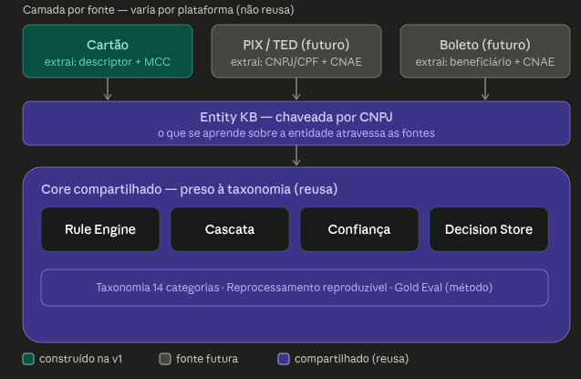

## Por que não "só o MCC" (nem "só IA")

O **MCC** é um código de 4 dígitos que a bandeira atribui ao tipo de estabelecimento (ex.: "5411 = supermercado"). É a forma mais simples e barata de adivinhar a categoria — mas é grosseira: em códigos genéricos (marketplaces como Mercado Livre, "varejo diverso", lojas de departamento, posto com loja de conveniência) ele **chuta uma categoria fixa e erra — e erra com confiança**, afirmando o errado como se fosse fato. Esse é o pior tipo de erro: mina a confiança do cliente.

A abordagem proposta resolve no nível do **estabelecimento** (mais específico que o código), deixa o time de produto **cravar à mão os poucos milhares de estabelecimentos que concentram ~85–90% do volume** de transações, e — o ponto decisivo — **defere quando não tem certeza, em vez de chutar errado**. Ela ganha no grosso confiável e para de afirmar no que não sabe.

| Abordagem | Acerto típico | No caso duvidoso | Custo por transação | Auditável / reproduzível |
|---|---|---|---|---|
| **Só MCC** | ~65–80% | chuta fixo (erra com confiança) | ~zero | sim, mas com teto baixo |
| **Só IA** (tudo no modelo) | acerto alto é possível | caixa-preta | recorrente + governança pesada de IA | difícil |
| **Nossa abordagem** | **alvo ~90%** | **defere** (não chuta errado) | ~zero no grosso | **sim, por design** |

> **Aviso de honestidade:** esses percentuais são faixas típicas de mercado, não medições da nossa base. Entregar o **número real, medido**, é justamente o produto da Fase 1. Ou seja: no fim dos 3 meses vocês não recebem uma promessa — recebem o dado para decidir a Fase 2.

## O que pretendemos entragar em cada fase

**Fase 1:** o cliente passa a ver o gasto do cartão dele organizado em 14 categorias (supermercado, saúde, viagem, restaurantes…) dentro do PFM — o que aumenta o engajamento e a retenção no produto. A estratégia por trás: **entregar valor rápido e barato, adotar IA só quando ela provar que se paga, e construir um motor que se reaproveita** para outros produtos.

## As três fases

| Fase | Período | O que cobre (linguagem simples) | O que fica pronto ao final |
|---|---|---|---|
| **1 — Fundação** | 0–3 meses | Categorização automática do cartão nas 14 categorias, usando regras + uma base de conhecimento de estabelecimentos + o código do tipo de negócio. Toda decisão fica rastreável. | Sistema **em produção** categorizando cartão, **auditável e reproduzível**, com o acerto real **medido** — e um "termômetro" para medir qualquer evolução futura. |
| **2 — Inteligência** | 3–6 meses | Decidir, **com dado na mão**, se a IA melhora o bastante para justificar o custo e a governança. Atacar os casos mais difíceis (ambíguos). | Uma **decisão go/no-go de IA baseada em evidência** ("a IA se paga?"), mais acerto nos casos difíceis e — se aprovada — IA em produção sob governança. |
| **3 — Personalização + expansão** | 6–9 meses | Aprender com as correções dos próprios clientes (personalizar por pessoa) e estender o mesmo motor a PIX/TED/boleto. | Categorização que **melhora sozinha** com o uso e uma **visão única de gastos** cobrindo cartão + outros meios de pagamento. |

O estado final aos 9 meses não é um recurso pontual: é uma **capacidade durável** — categorização que se aperfeiçoa sozinha, é auditável e cobre múltiplos meios de pagamento.

## As vantagens da abordagem

- **Valor rápido e barato:** sistema útil em 3 meses, custo por transação perto de zero, sem depender de IA não comprovada.
- **Confiável e auditável:** toda categorização é explicável e **reproduzível** (para o cliente, para disputas, para o regulador). IA pura não entrega isso de forma limpa.
- **Adoção de IA sem aposta cega:** construímos primeiro a régua; só adotamos IA onde ela **comprovadamente** supera o método simples e paga o próprio custo. Evita o clássico "queimar meses num modelo que perde para uma tabela".
- **Investimento que se multiplica:** o mesmo motor serve para IA, personalização e outros meios de pagamento. Um investimento, retorno crescente.
- **Medido, não prometido:** no mês 3 vocês têm um número real para decidir o mês 6. Decisão em dado, não em fé.

Então, cada fase entrega valor sozinha e habilita a próxima. A Fase 1 já coloca a categorização em produção, auditável, e mede o acerto real. As Fases 2 e 3 só recebem "sim" com base nesse número. Não estamos pedindo uma aposta em IA — estamos construindo a régua que diz, com evidência, se e onde a IA vale a pena.

## O que é específico e o que é reaproveitável?

**O que é preso à fonte e o que é preso à taxonomia?**

- **Preso à fonte** (muda, sim, por plataforma): consumir o evento, idempotência, e — o principal — **extrair os sinais** do evento bruto. Cartão tem descriptor sujo + MCC. PIX tem CNPJ/CPF do recebedor + descrição + nome. Boleto tem o beneficiário no código de barras. São formatos sem nada em comum. Essa camada é necessariamente nova por fonte.
- **Preso à taxonomia** (NÃO muda, e é o que não queremos reconstruir): a cascata, o score de confiança, o Decision Store, o reprocessamento reproduzível, o método do Gold Eval e — o ponto do pedido do Produto — as **14 categorias**. Nada disso sabe nem se importa se a entidade veio de um cartão ou de um PIX.Duas sacadas que valem pra defesa, porque é onde o cético vai cutucar:

