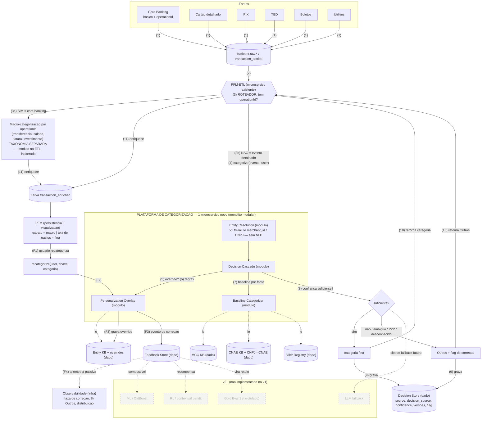

# RFC — Plataforma de Categorização Multi-Fonte
## v1 "MCC-first + Personalização Antecipada" — versão final

> **Status:** aprovada para execução (a ser seguida à risca)
> **Base:** re-adequação da RFC "ARB — Categorização PFM Cartão" às diretrizes do Head de Produto, consolidando as decisões de escopo acordadas.
> **O que mudou nesta versão final** (só os pontos alinhados): (1) override de cartão ancorado em **`merchant_id`**, não MCC; (2) **sem gold set formal** na v1 — medição por **telemetria passiva**; (3) **ETL como roteador** e **duas taxonomias coexistindo** (macro por `operationId` × fina); (4) **sem Lifecycle Service** — parcela tratada por regra básica; (5) **limites de deploy explícitos** (microserviço × módulo × dado × job × infra); (6) **Entity Resolution trivial** na v1 (só `merchant_id`/CNPJ, sem descriptor); (7) **workflow numerado** ligado ao diagrama; (8) **P2P → Outros** (sem categoria fina "Transferências").

---

# 0. Resumo executivo da estratégia

O Head de Produto pediu quatro mudanças. Elas **não simplificam o projeto** — **trocam a complexidade de lugar**. Saem a inteligência (ML, RL, IA generativa) e entram, antecipadamente, os dois itens mais difíceis do plano original: **multi-fonte** e **personalização**.

| # | Diretriz | Efeito |
|---|---|---|
| 1 | v1 categoriza cartão **só por MCC** (acurácia não é prioridade) | **Simplifica o baseline** |
| 2 | v1 já ingere **PIX, TED, Boletos e Concessionárias/Utilities** | **Antecipa multi-fonte** |
| 3 | **Antecipar personalização** (usuário recategoriza e cria regras) | **Antecipa personalização** (e a resolução de entidade) |
| 4 | Adiar acurácia — ML, **Reinforcement Learning**, **IA generativa de fallback** | **Adia a inteligência** para v2+ |

## A aposta, em uma frase

> Entregar uma categorização **barata e assumidamente imperfeita**, cobrindo **todos os meios de pagamento** desde o dia 1, com o **usuário podendo corrigir** — de modo que cada correção vire, no futuro, o dado de treino da inteligência que estamos adiando.

## Os três eixos que sustentam esta RFC

1. **O fallback da v1 é o usuário, não a LLM.** Como não há ML nem LLM, confiança baixa vira **`Outros` + exposição destacada para correção**. Consequência: **a UX de correção é infraestrutura**, não detalhe de produto. E como **não construiremos gold set formal** agora, a medição da v1 vem da **telemetria passiva** que o próprio loop de correção gera (taxa de correção, `% Outros`, distribuição) — de graça.

2. **Antecipar personalização obriga a antecipar a identidade da entidade — mas de forma trivial na v1.** Um override só "gruda" se houver uma **chave de entidade estável**. Na v1 essa chave é **`merchant_id`** (cartão) e **CNPJ** (PIX/boleto) — campos que já vêm no evento, **sem resolução de descriptor, sem NLP**. É "bom o suficiente" e evita o desastre de ancorar override em MCC (ver §2.2).

3. **A plataforma é isolada e o ETL a consulta; o ETL roteia entre duas taxonomias.** A categorização nasce como **contexto isolado** que o PFM-ETL **pergunta** (request/response). O ETL vira **roteador**: evento com `operationId` (só o core banking hoje) segue no fluxo antigo de **macro-categorização** (transferência, salário, fatura, investimento — **taxonomia separada, inalterada**); evento detalhado (cartão, PIX, TED, boleto, utilities) vai à **plataforma** e recebe a categoria **fina** (as 14). As duas taxonomias **convivem por design**; o mesmo PIX pode aparecer como "transferência" no extrato e "Outros" na tela de gastos, e **essa divergência é aceita**.

E o fecho que conecta com a estratégia adiada: **as correções do usuário na v1 são o combustível do v2.** A personalização antecipada é a **fábrica de rótulos** que ML, RL e LLM vão consumir quando entrarem. A ordem continua coerente com a filosofia do plano original ("determinístico-primeiro é a fábrica que produz o que falta ao ML"), só que **a fábrica de rótulos passa a ser o usuário**, e o **gold set formal fica adiado** (não deletado — vira pré-requisito duro do ML).

---

# 1. Reframe arquitetural — o que a mudança realmente faz

```
PLANO ORIGINAL                         PLANO v1 (final)
──────────────                         ────────────────
Baseline RICO (cartão)                 Baseline FINO (cartão = MCC-only)
  Merchant KB (moda histórica)   ─┐
  Head-labeling                   ├──► ADIADO p/ v2 (ganho de acurácia)
  Cascata determinística rica    ─┘
ML supervisionado                ────► ADIADO p/ v2
Vetores / embeddings             ────► ADIADO p/ v2
LLM fallback                     ────► ADIADO p/ v2 (slot reservado)
Reinforcement Learning           ────► ADIADO p/ v2 (novo pedido)
Lifecycle Service                ────► ADIADO p/ v2 (só eventos finais hoje)
Gold Eval Set (rotulado)         ────► ADIADO p/ v2  |  v1 usa TELEMETRIA PASSIVA
Personalização                   ────► ANTECIPADO p/ v1  ◄── first-class
Multi-fonte                      ────► ANTECIPADO p/ v1  ◄── first-class
Entity Resolution                ────► ANTECIPADO p/ v1, mas TRIVIAL (merchant_id/CNPJ)
Core source-agnostic             ────► PERMANECE (prova seu valor)
ETL como roteador + 2 taxonomias ────► NOVO (macro por operationId × fina)
Decision Store + lineage         ────► PERMANECE
Confiança + deferral             ────► PERMANECE (deferral → usuário, não ML)
Reprocessamento                  ────► PERMANECE
```

O ponto que um arquiteto cético nota: **você não entrega "menos" — entrega o encanamento inteiro + a personalização inteira, sem a inteligência.** O esforço da v1 migra de "modelar bem o classificador" para "modelar bem a identidade da entidade, o roteamento entre taxonomias e o loop de feedback".

---

# 2. Escopo da v1 — o que ENTRA

## 2.1 Categorização baseline por fonte (determinística, sem ML)

Cada fonte tem extração própria, mas todas desembocam no mesmo mecanismo: **código de atividade → categoria**, com confiança estática e nível de ambiguidade.

| Fonte | Chave de entidade (v1) | "Código de atividade" | Origem | Confiança típica |
|---|---|---|---|---|
| **Cartão** | **`merchant_id`** (do evento) | **MCC** (do evento) | próprio evento | média (limitada pela ambiguidade do MCC) |
| **PIX (para PJ)** | **CNPJ** | **CNAE** | lookup CNPJ→CNAE (base Receita) | média/alta |
| **TED (para PJ)** | **CNPJ** | **CNAE** | lookup CNPJ→CNAE | média/alta |
| **Boleto (cobrança)** | **CNPJ beneficiário** | **CNAE** | código de barras → CNPJ → CNAE | média/alta |
| **Utilities / Concessionárias** | convênio / segmento (arrecadação) | **biller registry** | registro de billers | **alta** (quase determinístico) |
| **PIX/TED P2P (para CPF)** | — não há negócio — | — | — | **→ Outros** (§2.4) |

**Sacadas por fonte:**

- **Cartão = MCC-only para categorizar, `merchant_id` para identidade.** Não computamos moda histórica de merchant na v1 (isso é v2). O `merchant_id` serve só para **ancorar overrides** — sem resolver descriptor, sem NLP.
- **PIX/TED/boleto = CNPJ → CNAE.** O evento traz CNPJ (ou chave PIX que resolve para CNPJ); constrói-se a tabela **CNPJ→CNAE** a partir da **base pública da Receita** e um seed **CNAE→categoria** (análogo ao seed MCC→categoria). Um CNPJ é uma chave de entidade melhor e mais limpa que qualquer descriptor de cartão.
- **Utilities são as mais fáceis** — biller conhecido / boleto de arrecadação → categorização quase determinística e de alta confiança. Menor esforço, maior acerto.

## 2.2 Personalização — first-class na v1

Três níveis, e a **granularidade** de cada chave é uma decisão de arquitetura, não detalhe:

- **Nível 1 — Override exato por entidade.** Cartão: **`(user_id, merchant_id) → categoria`**. PIX/boleto: **`(user_id, CNPJ) → categoria`**. Ambos no nível do **estabelecimento específico**.
  > **Por que `merchant_id` e não MCC (decisão consciente):** ancorar override em MCC faria a correção de *um* estabelecimento valer para *todos* daquele tipo — e no **MCC 5999** ("varejo diverso"), um balde de centenas de lojas sem relação, isso vaza a correção para tudo. Como o `merchant_id` **já vem no evento**, ancorar nele dá granularidade por estabelecimento **de graça**, sem resolver descriptor. Cai para MCC só se `merchant_id` faltar (e marcado como grosseiro).
- **Nível 2 — Regras do usuário (só "código → categoria pré-definida").** `MCC X → categoria` ou `CNAE Y → categoria`, com categorias **pré-definidas** (sem condição de valor, sem lógica composta) — subconjunto enxuto, com espaço para evoluir. Isso cria uma hierarquia limpa: **override do estabelecimento (`merchant_id`/CNPJ) vence regra do tipo (`MCC`/`CNAE`) vence baseline** — mesmo modelo mental para cartão e PIX.
- **Nível 3 — Categorias próprias do usuário.** Tabela `user_category` **separada** de `global_category`. **v1 ou fast-follow** (recomendação: níveis 1–2 na v1; nível 3 logo depois; mas o **split global/user nasce no modelo de dados da v1** para evitar migração).

## 2.3 Core compartilhado source-agnostic (permanece)

Event bus (Kafka) com `source`; cascata (§5); Decision Store com **lineage completo** (source, decision_source, confidence, versões); reprocessamento reproduzível; **medição por telemetria passiva** (não gold set — ver §2.4/§3); observabilidade.

## 2.4 Taxonomia — decisão fechada (duas taxonomias, sem novas categorias)

Há **duas taxonomias coexistindo por design**:

- **Macro-categorização** (transferência, salário, fatura de cartão, investimento) — vem do **`operationId` do core banking**, permanece **no PFM-ETL, inalterada**, é uma **entidade/tela separada** (extrato). **Não** passa pela plataforma nova na v1.
- **Categorização fina** — as **14 categorias** (Supermercado, Educação, Investimentos, Transporte, Restaurantes, Serviços, Saúde, Casa, Lazer, Combustível, Eletrônicos, Vestuário, Viagem, Outros) — produzida pela **plataforma nova** para a **tela de gastos**.

**P2P (PIX/TED para CPF) → `Outros`** na taxonomia fina. **Não** criamos categoria fina "Transferências": isso canibalizaria a macro-categoria "transferência" (que já existe no fluxo antigo) e borraria a fronteira entre as duas taxonomias. A natureza de transferência **já é capturada** pela macro-categoria no extrato.

**Divergência aceita:** o mesmo PIX pode aparecer como "transferência" no extrato (macro) e "Outros" na tela de gastos (fina). Isso é intencional. *Opção futura (não v1):* mover a regra de macro-categorização do `operationId` para dentro da plataforma, unificando o motor.

---

# 3. Escopo da v1 — o que fica ADIADO para v2+ (e por quê)

| Item adiado | Por que adiar | O que a v1 já deixa pronto |
|---|---|---|
| **ML supervisionado** + Feature Store + calibração + MRM | Sem rótulo maduro; MRM/drift é maquinário pesado | Decision Store + overrides = dataset; telemetria = sinal |
| **Embeddings / busca vetorial** | Ferramenta p/ merchant novo/ambíguo (acurácia) | Entity KB e (futura) normalização são a matéria-prima |
| **IA generativa (LLM) de fallback** | Na v1 o fallback é o usuário | Slot de fallback reservado na cascata |
| **Reinforcement Learning** (pedido do Head) | RL aqui = **contextual bandit / online learning** a partir do feedback (recompensa = aceitação/correção). Precisa de histórico de feedback | O **Feedback Store da v1 é o log de recompensa** |
| **Merchant KB por moda histórica** (categorizar) | Ganho de acurácia; diretriz é MCC-only | Entity KB já existe como registro + loja de overrides |
| **Head-labeling em escala** | Compete com "o usuário corrige"; opcional | É o **win de acurácia mais barato** se quiserem reduzir fricção |
| **Lifecycle Service / máquina de estado** | Só ingerimos **eventos finais** hoje (sem volta) | Parcela tratada por **regra básica** (§4.3, §9); estorno que chega como evento final é só mais um evento |
| **Gold Eval Set (rotulado à mão)** | Consome capacity de rotulagem humana | **Correções acumuladas na v1 viram seu insumo**; telemetria passiva cobre a medição da v1 |

**Sobre o gold set (para não ficar cego):** pulamos o **caro** (amostragem + rotulagem humana + fatia reservada), mas mantemos o **quase-grátis**: a **telemetria passiva** do loop de correção — **taxa de correção por fonte/categoria** (proxy de acurácia: correção alta = categorização ruim ali), `% Outros`, distribuição de categorias, `% por decision_source`. Custa perto de zero porque a matéria-prima (as correções) já será capturada. **No dia em que o ML entrar, o gold set vira pré-requisito duro** — está adiado, não deletado.

**RL para a alta gestão, sem buzzword:** cada categorização é uma "ação"; o usuário aceitar/corrigir é a "recompensa"; com o tempo o sistema aprende qual categoria tende a ser aceita naquele contexto (técnica realista: *contextual bandit*, online). **Exige histórico de feedback** — que a v1 começa a acumular. Vem depois porque **come o dado que a v1 produz**.

---

# 4. Arquitetura de referência (v1)

## 4.0 Limites de deploy (o que é microserviço × o que não é)

Regra da v1: **minimizar deployables independentes**. O desenho honesto é **1 microserviço novo + 1 banco + tópicos Kafka de feedback**. Quase todo o resto é **módulo in-process** ou **dado**.

| Componente | O que é de fato | Onde vive |
|---|---|---|
| **Plataforma de Categorização** | **Microserviço** (único deployable novo) — monólito modular | processo próprio; expõe `categorize()` e `recategorize()` |
| Baseline Categorizer | **Módulo in-process** | dentro da plataforma |
| Personalization Overlay | **Módulo in-process** | dentro da plataforma |
| Decision Cascade / Orchestrator | **Módulo in-process** | dentro da plataforma |
| Entity Resolution | **Módulo in-process** (v1 trivial: lê `merchant_id`/CNPJ) | dentro da plataforma |
| Regra de parcela | **Módulo in-process** (básico) — ou no adapter/ETL | ingestão / plataforma |
| MCC KB / CNAE KB / Biller Registry / CNPJ→CNAE | **Dado** (tabelas/lookup, cacheável em memória) | banco da plataforma |
| Entity KB / store de overrides | **Dado** (tabela) | banco da plataforma |
| Decision Store | **Dado** (tabela) | banco da plataforma |
| Feedback Store | **Dado** (tabela e/ou tópico Kafka) | banco / Kafka |
| Reprocessamento | **Job/processo** (batch/replay), não serviço em pé | acionado sob demanda |
| Observabilidade | **Infra** (métricas/traces) | plataforma de observabilidade |
| **PFM-ETL / PFM** | **Microserviços existentes** (seus) | já existem |
| Macro-categorização (`operationId`) | **Módulo existente no PFM-ETL** | permanece no ETL, inalterado |
| Lifecycle / máquina de estado | **adiado** | — |

## 4.1 Diagrama (com passos numerados)



## 4.2 Workflow passo a passo (ligado ao diagrama)

**Fluxo principal:**

- **(1)** A fonte publica o evento (core banking em `transaction_settled`; demais em `tx.raw.*`).
- **(2)** O **PFM-ETL** consome.
- **(3)** O ETL **roteia** pela presença de `operationId`:
  - **(3a)** *Tem* `operationId` (core banking) → **macro-categorização** (módulo existente no ETL, inalterado) → segue para (11).
  - **(3b)** *Não tem* (evento detalhado) → chama a plataforma: **`categorize(evento, user)`** → (4).
- **(4)** A plataforma resolve a **entidade** de forma trivial: lê `merchant_id` (cartão) ou CNPJ (PIX/boleto). Sem descriptor, sem NLP.
- **(5)** **Cascade — passo 1:** existe **override** exato do usuário para `(user_id, merchant_id|CNPJ)`? Se sim, retorna a categoria pessoal.
- **(6)** **Cascade — passo 2:** alguma **regra** do usuário casa (`MCC`/`CNAE → categoria`)? Se sim, retorna.
- **(7)** **Cascade — passo 3:** **baseline por fonte** — cartão: MCC→categoria; PIX/TED/boleto: CNPJ→CNAE→categoria; utilities: biller→categoria; P2P (CPF): → Outros.
- **(8)** **Cascade — passo 4:** **confiança suficiente?** MCC/CNAE não-ambíguo → afirma. Ambíguo/desconhecido → **`Outros` + flag de correção**.
- **(9)** Grava a decisão no **Decision Store** com lineage (source, decision_source, confidence, versões, flag).
- **(10)** Retorna a categoria (ou `Outros`) ao ETL.
- **(11)** O ETL **enriquece** e publica em `transaction_enriched` → **PFM** (extrato mostra a macro; tela de gastos mostra a fina).

**Loop de feedback:**

- **(F1)** O usuário **recategoriza** uma transação na UI do PFM.
- **(F2)** O PFM/ETL chama **`recategorize(user, chave, categoria)`**.
- **(F3)** A plataforma grava o **override** na Entity KB e um **evento de correção** no Feedback Store.
- **(F4)** A telemetria passiva alimenta a observabilidade (taxa de correção, `% Outros`, distribuição). *(No v2, o Feedback Store vira combustível de ML, recompensa de RL e insumo do gold set.)*

## 4.3 Papel de cada componente (resumo)

- **PFM-ETL (roteador, existente):** recebe todas as fontes, roteia por `operationId`, chama a plataforma para eventos detalhados, enriquece e entrega ao PFM. **Resiliência obrigatória:** timeout + circuit breaker + fallback — se a plataforma cair, o ETL marca `Outros`/"reprocessar" e segue; a plataforma **não é dependência dura** do pipeline.
- **Regra de parcela (básica):** se um parcelado chegar como N eventos (uma parcela cada), evita contar o gasto N vezes — **regra de representação/deduplicação**, não serviço, não máquina de estado. *(Confirmar como o parcelado chega: 1 evento vs. N eventos.)*
- **Entity Resolution (módulo, trivial):** lê `merchant_id`/CNPJ e produz a chave de override. Fuzzy/embeddings de identidade são v2.
- **Baseline Categorizer (módulo):** aplica o mecanismo por fonte da §2.1.
- **MCC KB / CNAE KB / Biller Registry / CNPJ→CNAE (dado):** seeds versionados. `código → categoria + prior + ambiguity_level`.
- **Personalization Overlay (módulo):** os três níveis da §2.2; fica **acima** do baseline (certeza do usuário sempre vence).
- **Decision Store (dado):** cada decisão com lineage → reprocessamento reproduzível e lago de treino do v2.
- **Feedback Store (dado/Kafka):** cada correção como evento → gold labels e recompensa do RL (v2).

---

# 5. Modelo de decisão da v1 (cascata)

```text
ORDEM DE DECISÃO (v1):

1. Override exato do usuário para (user_id, entity_key)?
   entity_key = merchant_id (cartão) | CNPJ (PIX/boleto)
   → user_category  [decision_source = user_override, confidence = 0.99]

2. Regra do usuário casa? (MCC → categoria | CNAE → categoria)
   → categoria da regra  [decision_source = user_rule, confidence = 0.95]

3. Baseline determinístico por fonte:
   3a. card:  mcc → MCC KB
         ambiguity LOW  → categoria [confidence = prior_alto]
         ambiguity MED  → categoria [confidence = prior_medio]
         ambiguity HIGH → passo 4
   3b. pix|ted|boleto (PJ): CNPJ → CNAE → CNAE KB (mesma lógica de ambiguidade)
   3c. utility / boleto de arrecadação: biller → categoria [confidence = 0.95]
   3d. pix|ted (CPF / P2P): → "Outros"  [decision_source = p2p_default]

4. Baixa confiança / MCC|CNAE ambíguo / entidade desconhecida:
   → "Outros"  [decision_source = outros_fallback, confidence = baixa]
   → flag "sugerir correção" (surface destacado no PFM)
```

**Confiança sem ML:** estática, derivada dos seeds. Determinístico forte (override, biller) `~0.95–0.99`; MCC/CNAE não-ambíguo → prior alto fixo; ambíguo → **não afirma**, vira `Outros` + flag. O `ambiguity_level` é setado à mão no seed e refinável depois pela telemetria.

**Por que isso é melhor que "só MCC afirmando tudo":** o "só MCC" é obrigado a chutar — inclusive nos códigos genéricos, onde **erra com confiança**. A cascata **defere** no ambíguo (→ `Outros` + correção) em vez de afirmar errado. Para banco, "errar com confiança" é o pior erro; a v1 troca por "deferir com humildade" — e o deferral vira dado de treino do v2.

---

# 6. Modelo de dados essencial (v1)

```text
canonical_transaction
- transaction_id
- source                     ◄── core_banking | card | pix | ted | boleto | utility   (NASCE na v1)
- source_event_id            (idempotência: purchase_id | e2eid | linha_digitavel | ...)
- entity_key                 ◄── merchant_id (cartão) | CNPJ (pix/boleto) | CPF-hash (P2P)
- entity_type                (pj | cpf | unknown)
- amount / currency / dates
- installment_info           (para a regra básica de parcela)
- raw_signals (json)         (mcc, cnae, biller_id, descricao_pix, ...)

global_category              ◄── as 14 (taxonomia FINA)     [macro vive separada, no ETL]
- category_id / name / taxonomy_version / active

user_category                ◄── SEPARADA de global (protege relatório) — NASCE na v1
- user_category_id / user_id / name / parent_global_category_id (nullable) / active

categorization_result        ◄── Decision Store
- transaction_id / source
- global_category_id / user_category_id (nullable)
- decision_source            (user_override | user_rule | mcc | cnae | biller | p2p_default | outros_fallback)
- confidence
- seed_version / rule_version / taxonomy_version
- flagged_for_review (bool)

user_override                ◄── NASCE na v1
- user_id / entity_key (merchant_id | CNPJ) / category_id / created_at

user_rule                    ◄── NASCE na v1 (só código → categoria pré-definida)
- user_id / condition (mcc = X | cnae = Y) / target_category_id / priority / active

feedback_event               ◄── correção = gold label do v2 = recompensa do RL
- user_id / transaction_id / from_category_id / to_category_id / created_at
```

**Os três campos que precisam nascer certos** (migração posterior é cara): **`source`** no Decision Store; a **`entity_key`** estável (`merchant_id`/CNPJ); e o **split `global_category` × `user_category`**.

## 6.2 Integração com o PFM (serving) — persistência, merge e exibição

Esta seção detalha como a categoria fina (e a do usuário) pousa na base do PFM (schema `serving`, star schema) sem duplicar o fato, e como coexiste com a macro-categorização do extrato. **Decisões confirmadas:** (a) um fato + segunda dimensão — compras de cartão como linhas fina-only, `CategoryId` nullable; (b) chave de merge = `OriginalTransactionId` (já existe no `serving` e já é usada pelo fluxo do salário); (c) backfill busca o histórico detalhado **direto na fonte de cada produto**.

**Princípio — um fato, duas dimensões de categoria.** A transação é um único fato (um `Amount`); macro e fina são dimensões distintas do mesmo fato, não fatos distintos. Não se duplica o fato numa tabela paralela — adiciona-se uma segunda dimensão. Isso evita duplicar `Amount`/data/cliente e o risco de os dois valores divergirem. (A tabela separada seria **mais** storage, não menos, pois duplicaria as linhas de overlap.)

**Bifurcação de granularidade do cartão (a decisão central).** Macro e fina são "o mesmo fato" para PIX/TED/boleto/utility (1 movimento = 1 linha no extrato = 1 linha em gastos), mas **não** para cartão: no extrato o cartão é a **fatura** (agregada, macro, mensal); em gastos são as **compras individuais** (finas). Fatura × compras é 1:N — fatos diferentes. Logo, `CategoryId` (macro) passa a ser **nullable**, e as duas colunas de categoria codificam sozinhas a que tela a linha pertence:

```text
CategoryId (macro) preenchido       → EXTRATO
ExpenseCategoryId (fina) preenchido → GASTOS
ambos → PIX/TED/boleto/utility/P2P | só macro → salário/fatura/transf. interna | só fina → compra de cartão
```

**Alterações na `serving.FactTransaction`:**

```sql
ALTER TABLE serving.FactTransaction ALTER COLUMN CategoryId INT NULL;   -- macro agora nullable (metadados; não reescreve a tabela)
ALTER TABLE serving.FactTransaction ADD ExpenseCategoryId INT NULL
    CONSTRAINT FK_Fact_ExpenseCategory REFERENCES serving.DimExpenseCategory(ExpenseCategoryId);
-- Sem coluna de correlação nova: OriginalTransactionId já é a chave de correlação (confirmado).
--   -> recomenda-se um índice de lookup por OriginalTransactionId (hoje só aparece em INCLUDE) para o merge em escala.
```

**Nova dimensão `serving.DimExpenseCategory` (fina global + usuário, com escopo)** — mantém a `DimCategory` (macro) **intacta**, para as finas não vazarem na agregação do extrato:

```sql
CREATE TABLE serving.DimExpenseCategory
(
    ExpenseCategoryId INT IDENTITY(1,1) PRIMARY KEY,
    CategoryName   VARCHAR(50)  NOT NULL,
    CategoryCode   VARCHAR(50)  NOT NULL,
    Scope          TINYINT      NOT NULL,   -- 0 = global (as 14) | 1 = usuário
    OwnerClientId  INT          NULL,       -- NULL global; ClientId p/ categoria do usuário
    DisplayOrder   INT          NOT NULL,
    CreatedAt      DATETIME2(3) NOT NULL DEFAULT SYSUTCDATETIME(),
    CONSTRAINT FK_ExpCat_Owner FOREIGN KEY (OwnerClientId) REFERENCES serving.DimClient(ClientId)
);
```

Um único FK (`ExpenseCategoryId`) aponta para essa dim, seja global ou do usuário → query path simples (uma coluna, um índice, sem `COALESCE` de duas dims). Correspondência com o modelo da plataforma (§6): `global_category` (14) → `Scope=0`; `user_category` → `Scope=1`.

**Categoria efetiva e override.** O `serving` guarda apenas a **categoria fina efetiva** (override do usuário se existir, senão a do sistema) em `ExpenseCategoryId`. Saber se foi sistema ou usuário é lineage e vive no Decision Store da plataforma (`truth`), não no `serving`. Override = **UPDATE de `ExpenseCategoryId`**, reutilizando o mesmo pipeline de recategorização que hoje já trata o salário.

**Merge por `OriginalTransactionId`, independente de ordem.** Para o overlap (PIX/TED/boleto/utility), a linha é upsert por `OriginalTransactionId`:

```text
Evento chega (macro OU fina):
  achar linha por OriginalTransactionId
    existe     -> UPDATE preenchendo a dimensão que falta
    não existe -> INSERT preenchendo a que veio; a outra fica NULL
```

Como o PIX sempre liquida no core banking, se a **fina chegar primeiro** o ETL bufferiza o resultado fino (evento já em `truth.TransactionEvent`; resultado no Decision Store) e aplica quando a macro chega — a linha nasce com `CategoryId` preenchido. O nullable do macro vem **só** das compras de cartão (que nunca têm linha macro), não da ordem do PIX. Compras de cartão → **INSERT fina-only** (sem merge).

**Mudança obrigatória na query do extrato (correção, não perf).** A query de total (`TotalCredit/TotalDebit/Result`) soma todas as linhas sem filtrar categoria; com compras de cartão como linhas fina-only ela passaria a contar **fatura + compras = dinheiro duplicado**. Ela **precisa** ganhar `WHERE CategoryId IS NOT NULL` (extrato = linhas com macro). A tela de gastos filtra `WHERE ExpenseCategoryId IS NOT NULL`.

**Índices filtrados para gastos (espelham os do macro, mas só sobre o subconjunto de gastos — pequenos e rápidos):**

```sql
CREATE NONCLUSTERED INDEX IDX_Fact_List_Expense_DateDesc
ON serving.FactTransaction (ClientId, ExpenseCategoryId, OccurredAt DESC, TransactionId)
INCLUDE (Amount, Description, DateId, OriginalTransactionId)
WHERE ExpenseCategoryId IS NOT NULL;
-- Agregação: estender IDX_FactTransaction_Agg_Client_Date para INCLUDE ExpenseCategoryId
--   (serve macro e fina no mesmo índice), ou um filtrado equivalente para gastos.
```

**Propagação de categorias plataforma→PFM.** O `serving` é a fonte das consultas, então toda categoria exibida existe como linha de dimensão nele: macro já está na `DimCategory`; as **14 finas** entram como **seed estático** em `DimExpenseCategory` (`Scope=0`); as **do usuário** entram como linhas por cliente (`Scope=1`, `OwnerClientId`), criadas por **propagação controlada** — a **plataforma é dona da verdade** das categorias; criar "Café" é um comando à plataforma, que persiste, devolve o id e projeta a categoria ao `serving` pelo mesmo pipeline de eventos que enriquece transações; o PFM faz upsert e passa a exibir. A agregação de gastos que dirige pela dimensão (para mostrar baldes vazios) filtra `WHERE Scope = 0 OR OwnerClientId = @ClientId`.

**Backfill (histórico de 1 ano — buscar direto na fonte de cada produto).** O pipeline de reprocessamento da plataforma categoriza o histórico detalhado (buscado direto na fonte de cada produto) e escreve no `serving`:
- Overlap (PIX/TED/boleto/utility) → **UPDATE** de `ExpenseCategoryId` casando por `OriginalTransactionId` (já presente nas linhas históricas).
- Compras de cartão → **INSERT** de linhas fina-only.

---

# 7. Uso dos atributos por fonte (v1)

## 7.1 Cartão (MCC categoriza; `merchant_id` ancora override)

| Atributo | Uso na v1 | Poder |
|---|---|---|
| `mcc` | **baseline** (único sinal de categoria) | alto (limitado pela ambiguidade) |
| **`merchant_id`** | **chave de override** (personalização) — **não** categoriza na v1 | muito alto p/ identidade |
| `merchant` (descriptor) | **não usado na v1** (resolução de descriptor é v2) | — |
| `installment*` | **regra básica de parcela** (não contar N vezes) | crítico p/ o saldo |
| `status` | elegibilidade (processada/estornada) | alto |
| `iof_amount`/`exchange_rate` | sinal determinístico de **Viagem** (IOF>0) — opcional como regra barata | médio/alto (caso específico) |
| `pan` | **nunca usar** | — |
| `account_id`/`card_id` | só **escopo de personalização**, com governança | — |

## 7.2 PIX / TED

| Atributo | Uso | Poder |
|---|---|---|
| CNPJ (ou chave PIX→CNPJ) | **entity_key + CNAE → categoria** | muito alto |
| `e2eid` | **idempotência** | — |
| CPF (P2P) | marca P2P → **Outros** | — |
| descrição / nome | v1 no máximo reforço; texto livre vira feature de ML no v2 | baixo/médio |

## 7.3 Boleto / Utilities

| Atributo | Uso | Poder |
|---|---|---|
| código de barras / linha digitável | decodifica → **CNPJ beneficiário** (cobrança) ou **segmento** (arrecadação) | alto |
| convênio / biller id | **biller registry → categoria** | muito alto |

---

# 8. Diferença vs. plano original — componente a componente

| Componente | Plano original | Plano v1 (final) | Situação |
|---|---|---|---|
| Event bus + schema canônico | Fase 1 | **v1, `source`-tagged** | **Permanece** (ampliado) |
| Source Adapters | 1 (cartão) | **5 (cartão, PIX, TED, boleto, utilities)** | **Ampliado** |
| **PFM-ETL como roteador + 2 taxonomias** | inexistente | **v1** (macro `operationId` × fina) | **Novo** |
| Macro-categorização (`operationId`) | — | **permanece no ETL, inalterada** | **Inalterado** |
| Entity Resolution | enabler de acurácia | **v1 trivial (merchant_id/CNPJ), enabler de personalização** | **Muda de papel / simplificado** |
| Entity/Merchant KB | moda histórica (rica) | **registry + loja de overrides** (sem moda histórica) | **Reduzido** |
| MCC KB | Fase 1 | **v1** | **Permanece** |
| CNAE KB + CNPJ→CNAE (Receita) | inexistente | **v1** | **Novo** |
| Utility Biller Registry | inexistente | **v1** | **Novo** |
| Baseline Categorizer | cascata rica | **cascata fina, source-aware** | **Simplificado** |
| Personalization Overlay | Fase 3 | **v1 (níveis 1–2; nível 3 fast-follow)** | **Antecipado** |
| Override — chave | (n/a) | **`merchant_id` (cartão) / CNPJ (PIX)** | **Definido** |
| Regras do usuário | complexas | **só `código → categoria pré-definida`** | **Reduzido** |
| global × user category split | Fase 3–4 | **v1 (no modelo de dados)** | **Antecipado** |
| Decision Store + lineage | Fase 1 | **v1, com `source`** | **Permanece** |
| Feedback Store | Fase 3 | **v1 (motor da estratégia)** | **Antecipado** |
| Reprocessamento | Fase 1 | **v1** | **Permanece** |
| **Medição** | Gold Eval rotulado (Fase 1) | **telemetria passiva na v1; gold set adiado** | **Trocado** |
| Regra de parcela | (dentro do Lifecycle) | **regra básica, sem serviço** | **Simplificado** |
| **Lifecycle Service** | Fase 1 | **v2+** (só eventos finais hoje) | **Adiado** |
| **ML + Feature Store + calibração + MRM** | Fase 2 | **v2+** | **Adiado** |
| **Embeddings / Vector Index** | Fase 2 | **v2+** | **Adiado** |
| **LLM fallback** | Fase 2 | **v2+ (slot reservado)** | **Adiado** |
| **Reinforcement Learning** | (não existia) | **v2+ (Feedback Store = log)** | **Adiado (novo pedido)** |
| **Head-labeling** | Fase 1–2 | **v2 opcional** | **Adiado / opcional** |
| P2P | (n/a) | **→ Outros (sem categoria fina "Transferências")** | **Definido** |

---

# 9. Passo a passo de implementação (v1) — o roteiro

Cada etapa: **objetivo / entregável / pronto quando**.

## Etapa 0 — Encanamento multi-fonte + roteador do ETL
- **Objetivo:** ingerir as fontes e rotear macro × fina.
- **Entregável:** tópicos `tx.raw.*`, Schema Registry, DLQ por fonte, idempotência por `source_event_id`; **ETL roteando por `operationId`** (core banking → macro inalterada; detalhados → chamar plataforma) com **timeout + circuit breaker + fallback para `Outros`**.
- **Pronto quando:** um evento de cada fonte vira `canonical_transaction` com `source` correto e é roteado corretamente; queda da plataforma não paralisa o PFM.

## Etapa 1 — Source Adapters + extração + regra de parcela
- **Objetivo:** extrair o sinal certo de cada formato.
- **Entregável:** adapter por fonte (cartão: MCC + `merchant_id` + installment + status; PIX/TED: CNPJ/CPF + e2eid; boleto: decodificação → beneficiário/segmento; utility: biller); **regra básica de parcela**.
- **Pronto quando:** cada fonte popula `raw_signals`, classifica `entity_type` e não duplica gasto de parcelado.

## Etapa 2 — Seeds + Entity Resolution trivial
- **Objetivo:** bases de referência e chave de override.
- **Entregável:** **MCC KB**; **CNAE KB** + tabela **CNPJ→CNAE** (base Receita); **Utility Biller Registry**; **Entity Resolution** trivial (lê `merchant_id`/CNPJ).
- **Pronto quando:** dado um evento, existe `entity_key` estável e código de atividade resolvido quando aplicável.

## Etapa 3 — Baseline Categorizer + Decision Store
- **Objetivo:** categorizar deterministicamente com lineage.
- **Entregável:** cascata da §5 (passos 3–4); Decision Store com `source`/`decision_source`/`confidence`/versões/flag.
- **Pronto quando:** toda transação recebe categoria (ou `Outros` + flag), 100% rastreável, e o reprocessamento por versão reproduz o resultado.

## Etapa 4 — Personalization Overlay
- **Objetivo:** dar ao usuário o poder de corrigir.
- **Entregável:** **nível 1** override `(user_id, merchant_id|CNPJ)`; **nível 2** regras `código → categoria`; **nível 3** categorias próprias (v1 ou fast-follow); split `global × user` no modelo de dados; API `recategorize()`.
- **Pronto quando:** o usuário recategoriza e a **próxima transação da mesma entidade** já respeita o override; regra criada se aplica.

## Etapa 5 — Feedback loop + telemetria + observabilidade + reprocessamento
- **Objetivo:** fechar o loop e medir barato (acumulando o combustível do v2).
- **Entregável:** **Feedback Store** gravando cada correção; **telemetria passiva** (taxa de correção por fonte/categoria, `% Outros`, distribuição, `% por decision_source`, latência p95, consumer lag, DLQ); reprocessamento por versão.
- **Pronto quando:** há dashboards com a telemetria por fonte e o Feedback Store persiste correções em formato reaproveitável como rótulo. *(Gold set formal fica para o v2.)*

---

# 10. Riscos específicos DESTA estratégia

1. **A UX de correção é o ponto único de falha — e virou infraestrutura.** Se corrigir for chato, ninguém corrige: o produto parece ruim **e** o v2 fica sem gold labels. **Mitigação:** tratar a correção como requisito de arquitetura; `flagged_for_review` destacado; correção 1-toque; **medir pela taxa de correção** (telemetria); head-labeling opcional se a fricção for alta.
2. **Acurácia baixa no launch pode queimar a primeira impressão.** **Mitigação:** categoria **editável e provisória**; começar pelas fontes de maior acerto (utilities, PIX-PJ); não exibir baixa confiança como afirmação categórica.
3. **Multi-fonte multiplica a superfície de integração.** **Mitigação:** DLQ por fonte; entregar as fontes **incrementalmente** (utilities e PIX primeiro; cartão e boleto depois); regra de parcela desde a Etapa 1.
4. **P2P → `Outros` incha o balde "Outros".** Em Brasil, P2P é volume gigante; "Outros" tende a virar uma fatia grande da tela de gastos. **Decisão consciente:** aceitamos, porque a natureza de transferência **já aparece no extrato** (macro-categoria) e **não** queremos canibalizar as duas taxonomias. **Mitigação de percepção:** a tela de gastos pode filtrar/《separar visualmente》o que é P2P, sem criar categoria fina.
5. **Categorias próprias fragmentam relatórios globais.** **Mitigação:** o **split `global × user` nasce na v1**.
6. **Risco estratégico: "a personalização vira o produto e o v2 nunca é priorizado".** **Mitigação:** **gatilho objetivo** para acionar o v2 (ex.: taxa de correção > X% em categorias/fontes-chave, ou N correções acumuladas por categoria). Sem gatilho, a acurácia base fica eternamente ruim, apoiada no trabalho do usuário.
7. **Duas taxonomias convivendo.** Macro (`operationId`, extrato) × fina (14, gastos) são entidades/telas separadas — **por design**, e é o de menor risco agora. **Registro:** no dia em que o Produto quiser **visão única** (uma taxonomia só cobrindo core + cartão + PIX), as duas colidem e a reconciliação vira trabalho real (a opção futura de mover a macro para dentro da plataforma endereça isso).
8. **Identidade de cartão limitada por design.** Sem resolver descriptor, a identidade de cartão é só `merchant_id`. Se o mesmo lojista aparecer com `merchant_id` diferente em adquirentes diferentes, o override não se propaga. **Mitigação:** aceito na v1; resolução robusta de identidade é v2.

---

# 11. Como a v1 alimenta o v2 (handoff para ML / RL / IA generativa)

Adiar a inteligência **não desperdiça nada** — a v1 é o substrato dela:

- **Decision Store + `feedback_event`s = dataset rotulado.** Decisões determinísticas = rótulo fraco; **overrides do usuário = rótulo forte** (o mais valioso).
- **Telemetria passiva = régua barata da v1.** Mede onde o erro está (taxa de correção) sem gold set. **O gold set formal entra no v2 como pré-requisito duro do ML** — e as correções acumuladas agora são o seu insumo.
- **Entity KB / MCC / CNAE KB = features + rótulo fraco** para o modelo futuro.
- **A cascata = esqueleto onde ML/LLM plugam.** O slot de fallback (passo 4) hoje aponta para "Outros + correção"; amanhã, para o ML e, na cauda, para a LLM — **sem reescrita**.
- **Feedback Store = log de recompensa do RL** (contextual bandit). O RL não nasce antes porque **come o dado que a v1 produz**.

> Em uma frase: **a v1 determinística e personalizada não é "a versão sem IA" — é o gerador de dados da IA.**

---

# 12. Frases de defesa (ARB / alta gestão)

- **MCC-only na v1:** "Entregamos cedo e barato. MCC-only cobre o grosso do cartão com custo quase zero; onde é ambíguo, não afirmamos errado — deferimos para o usuário corrigir, e cada correção vira dado de treino do modelo futuro."
- **Multi-fonte já na v1:** "Não é uma estrutura nova por fonte — é um front-end de extração por fonte sobre um core compartilhado. Cartão tem MCC; PIX/boleto têm CNPJ→CNAE. A cascata, o Decision Store e as 14 categorias são os mesmos."
- **Plataforma isolada + ETL roteador:** "A categorização é um contexto isolado que o ETL pergunta. O ETL roteia: `operationId` segue na macro-categorização do extrato, inalterada; o detalhado vai à plataforma para a categoria fina de gastos. Duas taxonomias convivem por design."
- **Override em `merchant_id`, não MCC:** "É de graça (o campo já vem no evento) e evita que corrigir uma loja recategorize um balde inteiro — especialmente o MCC 5999."
- **Personalização já na v1:** "É o mecanismo que compensa a acurácia baixa que aceitamos de propósito — e é a fábrica de rótulos do futuro."
- **ML/RL/LLM depois:** "Não é falta de ambição: ML precisa de rótulo maduro; RL precisa de histórico de feedback, que a v1 acumula; a LLM só se justifica na cauda depois de medirmos onde o erro mora. A v1 é o pré-requisito dos três."
- **O risco consciente:** "O ponto único de falha é a UX de correção. Por isso a tratamos como infraestrutura e definimos um gatilho objetivo para acionar o v2 — para a personalização não virar desculpa para nunca melhorar a base."

---

## Anexo — Decisões (fechadas × abertas)

**Fechadas:**
1. **Taxonomia:** duas coexistindo — macro (`operationId`, extrato, inalterada) × fina (14, gastos). **P2P → Outros**, sem categoria fina "Transferências".
2. **Roteamento:** ETL roteia por `operationId` (core banking → macro; detalhados → plataforma).
3. **Override:** `merchant_id` (cartão) / CNPJ (PIX-boleto); regras só `código → categoria pré-definida`.
4. **Medição:** telemetria passiva na v1; gold set adiado para o v2.
5. **Lifecycle:** adiado; parcela por regra básica.
6. **Deploy:** 1 microserviço novo (plataforma, monólito modular) + banco + Kafka de feedback; resto é módulo/dado/job.
7. **Modelo no `serving` (PFM):** um fato + segunda dimensão `ExpenseCategoryId`; `CategoryId` (macro) **nullable**; compras de cartão como linhas fina-only; membership de tela por presença de coluna. Dims: `DimCategory` (macro) intacta + nova `DimExpenseCategory` (fina global + usuário, com `Scope`).
8. **Chave de merge = `OriginalTransactionId`** (já existe no `serving`; já usada pelo fluxo do salário) — sem coluna de correlação nova; merge independente de ordem; recomenda-se índice de lookup por `OriginalTransactionId`.
9. **Backfill:** histórico detalhado de 1 ano existe e será buscado **direto na fonte de cada produto**; overlap → UPDATE de `ExpenseCategoryId` por `OriginalTransactionId`; cartão → INSERT de linhas fina-only.

**Abertas (a confirmar antes/durante a Etapa 1):**
- Como o **parcelado chega**: 1 evento (compra cheia) ou N eventos (parcela a parcela)?
- **Escopo do nível 3** (categorias próprias): v1 ou fast-follow?
- **Ordem de entrada das fontes** (recomendado: utilities → PIX-PJ → cartão → boleto → TED/P2P).
- **Gatilho objetivo do v2** (taxa de correção X% ou N rótulos/categoria).
- **Cadência de atualização** da base CNPJ→CNAE (Receita).
